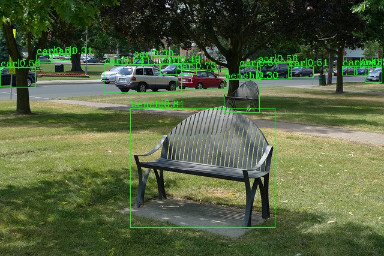
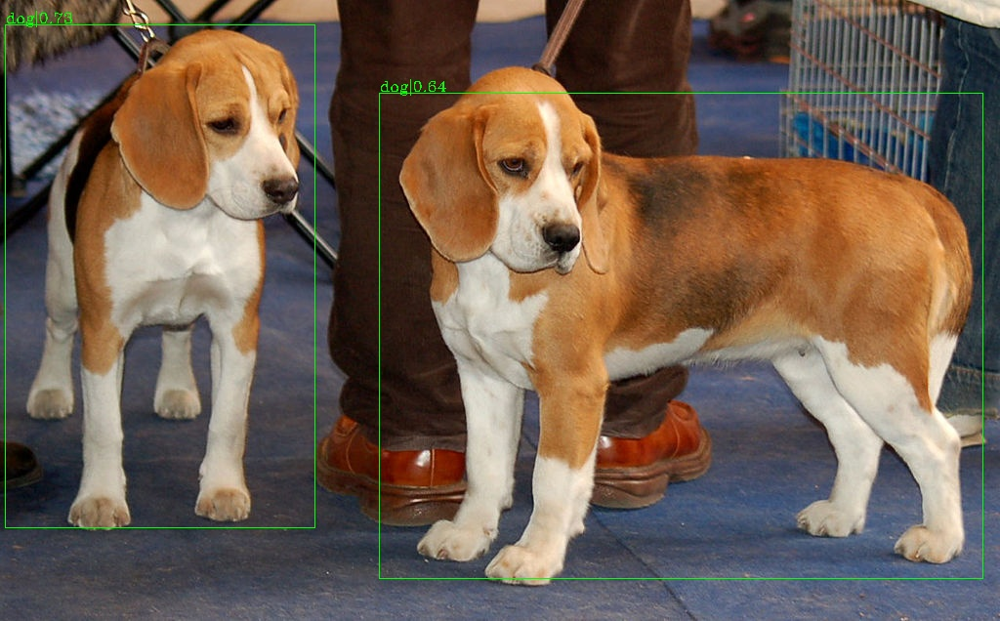

# ATSS-EfficientDet-PyTorch

ATSS-EfficientDet ([ATSS](https://arxiv.org/pdf/1912.02424.pdf) built on top of [EfficientDet](https://arxiv.org/pdf/1911.09070.pdf)) ```outperforms``` the original EfficientDet.

This repository is folked from [mmdetection](https://github.com/open-mmlab/mmdetection), implemented in [PyTorch](https://pytorch.org/).

## Introduction

<p align="center">
  
  
  <br>
  <em>Demo images predicted by ATSS-EfficientDet-D0</em>
</p>

See more demo images in [demo/atss_effdet_d0](demo/atss_effdet_d0)


## Comparison

|         Model        | Params (M) | FLOPs (G) | COCO-val mAP | Official COCO-val mAP |
|:--------------------:|:----------:|:---------:|:------------:|:---------------------:|
| ATSS-EfficientDet-D0 |    3.83    |    2.32   |     33.8     |          33.5         |


## Installation

Please refer to the official guildeline of [mmdetection](https://github.com/open-mmlab/mmdetection) in [INSTALL.md](docs/INSTALL.md) for installation and dataset preparation.


## References

* Two papers:
  - [EfficientDet: Scalable and Efficient Object Detection](https://arxiv.org/pdf/1911.09070.pdf)
  - [Bridging the Gap Between Anchor-based and Anchor-free Detection via Adaptive Training Sample Selection](https://arxiv.org/pdf/1912.02424.pdf)

* Three repositories:
  - [mmdetection](https://github.com/open-mmlab/mmdetection)
  - [automl/efficientdet](https://github.com/google/automl/tree/master/efficientdet)
  - [pytorch-image-models](https://github.com/rwightman/pytorch-image-models)


## Citation

```
@article{atssefficientdet,
  title   = {ATSS-EfficientDet: ATSS built on top of EfficientDet},
  author  = {Thuy Nguyen-Chinh},
  journal= {https://github.com/thuyngch/ATSS-EfficientDet-PyTorch},
  year={2020}
}
```
